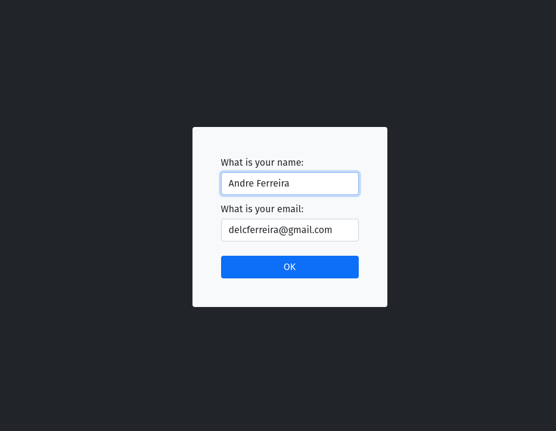
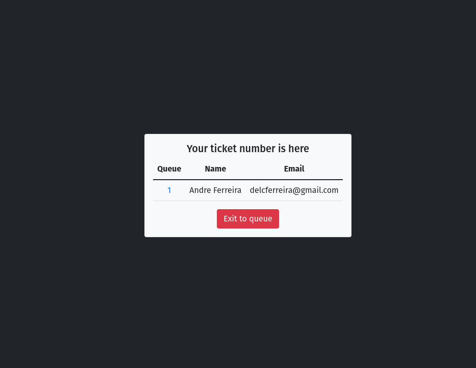
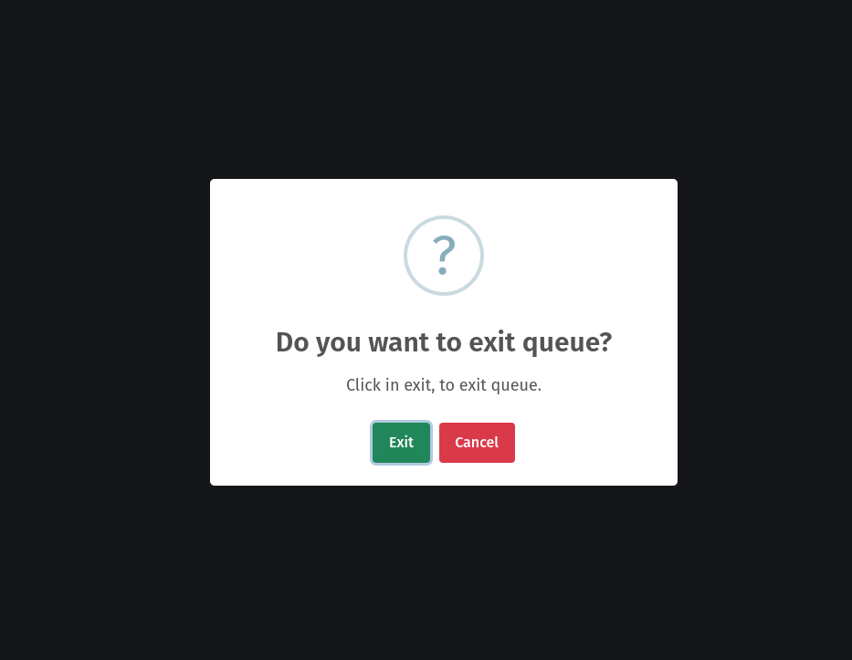
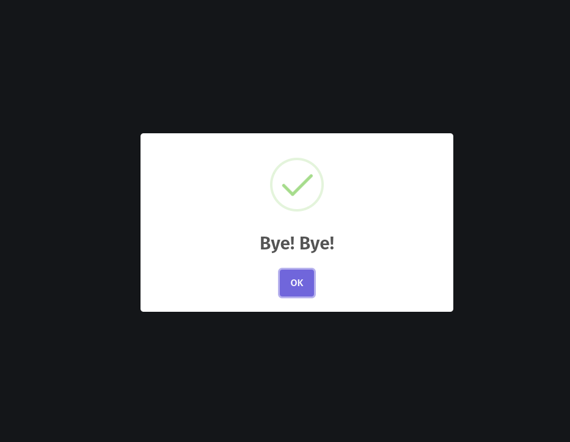

<p align="center">
    
</p>

# SERVING-NOW

## About

Welcome to queue project! I create this project named electronic queue, for help all peoples when wait in queue. What you need to run this project? You need Node.js for run javascirpt, and mongodb, a database NoSQL.

## How you can run

```bash
    npm install
    npm run dev
```

## Env Example

```text
LOCAL="dev"
PORT=3000
MONGO_DB_URL="your_mongo_db_url"
```

## Demo

<div align="center">
    
    
    
    
</div>
